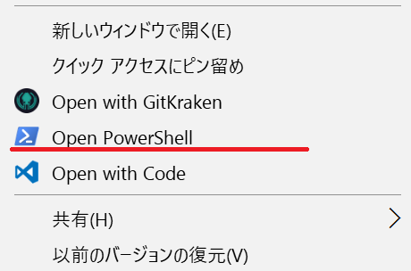
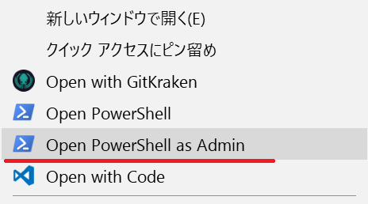

# Add Open PowerShell command to exproler context menu

## Open PowerShell as current user
* Open PowerShell.reg
  * add registry entries
* Open PowerShell-Remove.reg
  * remove entries

## Open PowerShell as Administrator
* Open PowerShell as Admin.reg
  * add registry entries
* Open PowerShell as Admin-Remove.reg
  * remove entries

